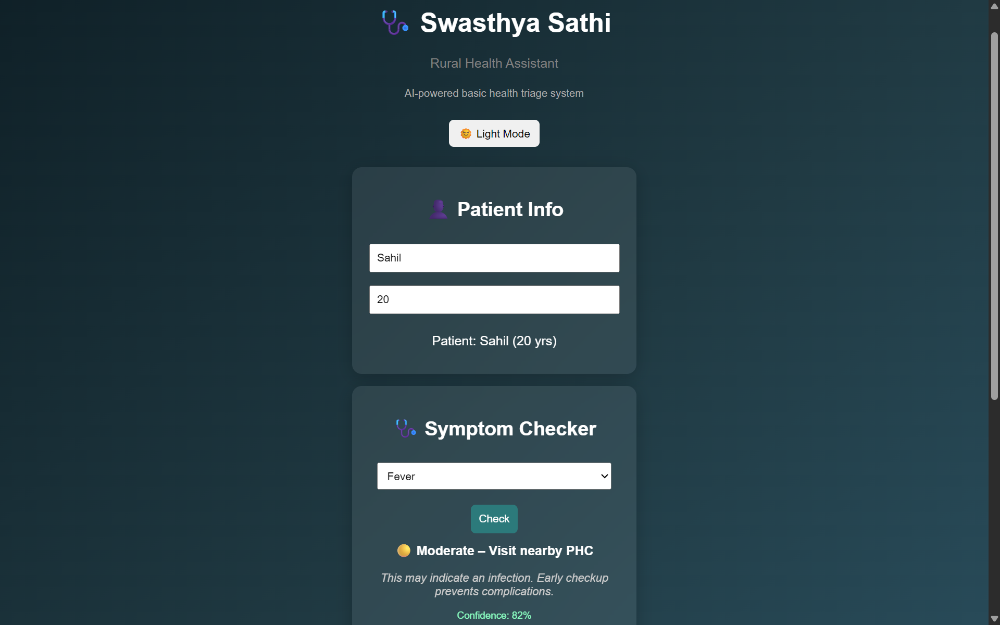
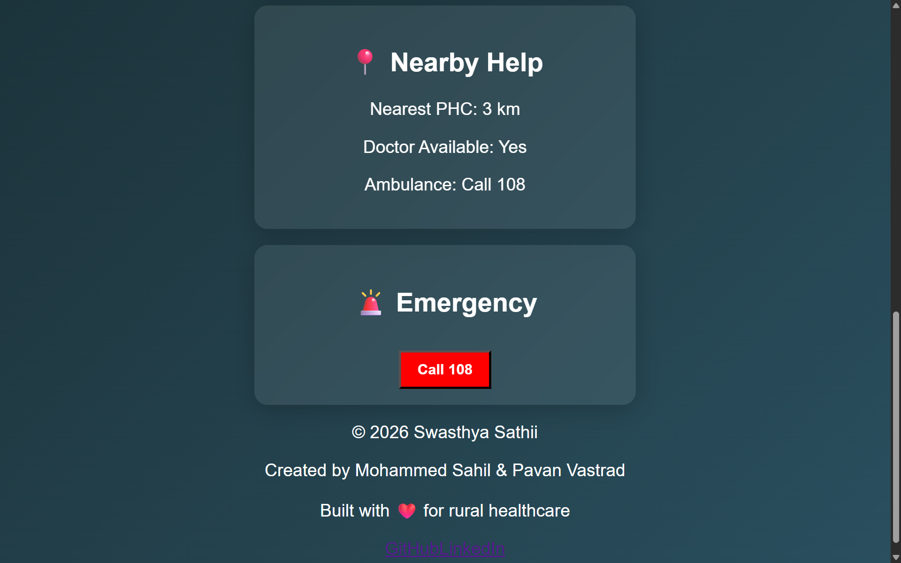

🏥 Swasthya Sathii
An AI-powered rural health assistant that helps users check symptoms, assess severity, and find nearby medical help instantly.
🌐 Live Demo: https://swasthya-sathii.vercel.app

🚀 Problem
In many rural areas, people:

Don’t know whether their symptoms are serious
Delay visiting hospitals due to uncertainty
Lack quick access to basic medical guidance

This often leads to late treatment and avoidable health complications.

💡 Solution
Swasthya Sathii acts as a basic health triage assistant that:

Takes user symptoms
Evaluates severity (Mild / Moderate / Severe)
Provides guidance on next steps
Suggests nearby healthcare help

✨ Features

🧠 Symptom Checker
⚠️ Severity Detection
📊 Confidence Score
📍 Nearby PHC Information
🚑 Emergency Call (108)
🌗 Light/Dark Mode

📸 Screenshots
🔹 Main Interface (Title, Patient Info & Symptom Checker)
 

🔹 Additional Features (Nearby Help, Emergency & Footer)
 

🛠️ Tech Stack

React (Vite)
JavaScript
CSS
Vercel (Deployment)

⚙️ How to Run Locally
git clone https://github.com/Mdsahil01/swasthya-sathi.git
cd swasthya-sathi
npm install
npm run dev

🌍 Real-World Impact
This project is built with a vision to:

Improve access to basic healthcare guidance in rural areas
Reduce unnecessary hospital visits
Encourage timely medical decisions

⚠️ Disclaimer
This is a basic health assistant and not a replacement for professional medical advice.

👨‍💻 Authors
Mohammed Sahil
B.Tech CSE | Aspiring AI Entrepreneur
🔗 GitHub: https://github.com/Mdsahil01
🔗 LinkedIn: https://www.linkedin.com/in/mdsahil01/
Pavan Vastrad

❤️ Built For
Built with ❤️ for improving rural healthcare accessibility.
